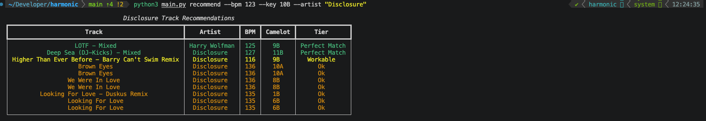

# Harmonic — Roadmap

## Completed

- `auth.py` — Spotify OAuth with token caching
- `api.py` — full data pipeline: Spotify search → ReccoBeats ID mapping → audio features fetch → track data merging
- `matching.py` — Camelot lookup table, `to_camelot()` conversion, circular Camelot distance, `rank_tracks()` with tiered scoring
- `display.py` — color-coded rich terminal table (green/yellow/orange by tier)
- `main.py` — working `recommend` command with loading spinner

**Working command:**
```
python3 main.py recommend --bpm 123 --key 10B --artist "Disclosure"
```



---

## In Progress / TODOs

### Pagination
- `get_all_artist_tracks` is capped at 40 tracks (`tracks[:40]`) — needs pagination through full artist catalog
- `artist_albums()` uses `limit=5` — needs a `while` loop on `next` to fetch all albums
- ReccoBeats ID mapping should process in batches of 40 (chunking logic exists but limit needs confirming)
- for the playlist flow we will need pagination for the user's playlists and also the tracks within the playlist

### `recommend` command — remaining flows
- `--track "Song Name"` input: disambiguate track, auto-fetch BPM and key, then run recommendation flow
- `--playlist` flag: list user's Spotify playlists, let user pick one, use as candidate pool instead of artist catalog
- Make `--artist` truly optional once playlist flow is implemented

### Display
- Table title could be more descriptive based on the query (artist name, BPM, key used)

---

## Future: set command

Propose a running order for a full DJ set from a Spotify playlist.

- User provides a playlist and one or more starting tracks
- Tool proposes an order for the remaining tracks using harmonic compatibility logic
- Intentional randomness so repeated runs produce different but musically valid suggestions
- Built on top of the same Camelot chain logic as `recommend`

**Example:**
```
harmonic set --playlist --start "One More Time"
```

---

## Future: local track database

Cache all fetched track data in a local SQLite database so the app builds up a personal knowledge base over time.

- Every track looked up via ReccoBeats gets stored locally (Spotify ID, name, artist, BPM, key, Camelot, full audio features)
- On subsequent lookups, check local cache first — faster and resilient to API changes
- If ReccoBeats ever goes away, cached data remains usable
- Could eventually support `harmonic stats` or similar commands

Implementation: `sqlite3` from Python stdlib. A new `db.py` module in the package.

---

## Known Constraints
- Spotify audio features, audio analysis, and recommendations endpoints are restricted for new developer apps (since Nov 2024) — audio data sourced from ReccoBeats instead
- No broad discovery without a candidate pool (artist or playlist required)
